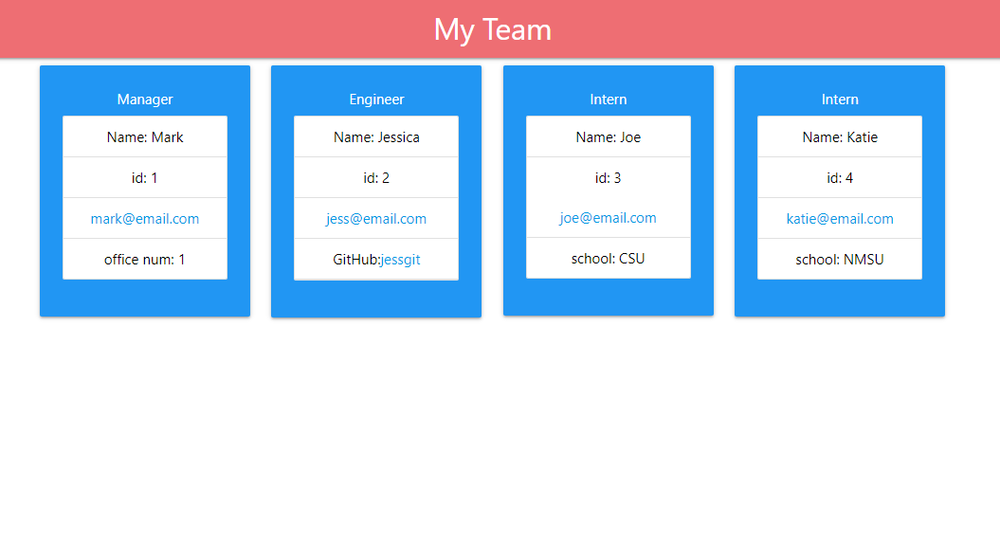

# Title: Team Profile Generator

  
  ## Descrption: 
  Using a command line application a manager can automatically create a website listing their team including engineers and interns.  The site lists names, IDs, emails along with GitHub usernames and schools if applicable. 

  ## Table of Contents:

  * [Installation](#installation)

  * [Usage](#usage)

  * [License](#license)

  * [Contributing](#contributing)

  * [Tests](#tests)

  * [Questions](#questions)

  ## Installation 
  You will need to be running node.js.  Inquirer and Jest will also need to be installed and initialized. 

  ## Usage 
  A manager will follow prompts to enter their name, id, email and office number.  Then they will be given a choice of adding an engineer or intern. After completing the engineer or inter's information the application will continue to ask the same question until the manager chooses "quit". When that is choosen a index.html file will be created in the root of the app that displays the team's information.  

  ## License 
  This application is covered by the MIT license.  Click the link for more information. 

  [https://opensource.org/licenses/MIT](https://opensource.org/licenses/MIT)

  ## Contributing 
  Mark Raudenbush

  ## Tests
  Testing is done using Jest

  ## Questions 
  You can access my GitHub profile throught the following link.
  [My GitHub](https://github.com/markraud)

  [Link to GitHub Repository](https://github.com/markraud/team-profile-generator).

  Please email with any questions.
  [markraud@hotmail.com](mailto:markraud@hotmail.com)

